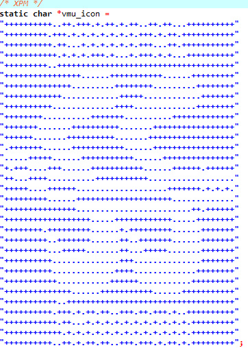

# VMU Icon Converter

This tool converts a 48x32 pixel BMP image into a VMU icon format compatible with Dreamcast VMU (Visual Memory Unit) icons. It generates a C header file containing the icon data in XPM format.
# For KallistiOS
## Features

- ✨ Converts 48x32 BMP images to VMU icon format
- 📄 Generates a C header file (`vmu_icon.h`) with the icon data
- 🚀 Simple batch file for easy conversion

## Requirements

- 🖥️ Windows operating system
- 🖼️ A 48x32 pixel BMP image file named `input_file.bmp` (see BMP File Requirements below)
- 🛠️ The `vmuxpm.exe` executable (provided in this repository)

## BMP File Requirements

To ensure proper conversion, your input BMP file must meet the following specifications:

- 📏 **Dimensions**: Exactly 48 pixels wide by 32 pixels high
- 🎨 **Color Mode**: Indexed color (2 colors)
- 🖌️ **Bit Depth**: 8-bit
- 🔢 **Gamma**: Integer
- 📁 **File Format**: Standard Windows BMP format (uncompressed)
- 🔠 **File Name**: Must be named `input_file.bmp`

**Note**: The image should be black and white, where:
- Black pixels will be displayed as on (visible) on the VMU
- White pixels will be displayed as off (invisible) on the VMU

## Usage

1. Clone or download this repository to your local machine.
2. Create or prepare your 48x32 pixel BMP image according to the specifications above. You can use image editing software like GIMP or Photoshop to ensure the correct format.
3. Place your BMP image in the same directory as the batch file and rename it to `input_file.bmp`.
4. Ensure `vmuxpm.exe` is in the same directory.
5. Run the `convert_to_vmu_icon.bat` batch file by double-clicking it or executing it from the command line.
6. If successful, a `vmu_icon.h` file will be generated in the same directory.

## Example Output

Here's an example of what the generated `vmu_icon.h` file might look like:



This image shows the XPM format of a converted VMU icon. The `+` symbols represent the visible pixels on the VMU, while the `.` symbols represent the invisible pixels.

## File Descriptions

| File | Description |
|------|-------------|
| `vmuxpm.exe` | The executable that performs the conversion |
| `convert_to_vmu_icon.bat` | Batch file to automate the conversion process |
| `input_file.bmp` | Your input 48x32 pixel BMP image (you need to provide this) |
| `vmu_icon.h` | The output file containing the VMU icon data in XPM format (generated after running the batch file) |

## How It Works

The converter reads the input BMP file, which should already be in a black and white, 2-color indexed format. It then generates a C header file with the image data in XPM format, which can be easily included in Dreamcast development projects.

## Troubleshooting

- ✅ Ensure your input image meets all the BMP file requirements listed above, especially the color mode and bit depth.
- ✅ Use image editing software to confirm your BMP is in 2-color indexed mode with 8-bit depth.
- ✅ Make sure all files (`vmuxpm.exe`, `input_file.bmp`, and the batch file) are in the same directory.
- ✅ If you encounter any errors, check the console output for specific error messages.

## Contributing
Credit to enfilade for vmu icon art.
Contributions to improve the converter are welcome.
Please feel free to submit pull requests or open issues for any bugs or enhancements.

## License

This project is licensed under the MIT License - see the [LICENSE](LICENSE) file for details.

## Acknowledgements

This tool uses the [STB image library](https://github.com/nothings/stb) for image processing.

## Compiling on Linux

# Using VMU Icon Converter on Linux

## Compilation

1. Ensure you have GCC and Make installed on your system.
2. Place the following files in the same directory:
   - `Makefile`
   - `vmuxpm.c`
   - `stb_image.h`
3. Open a terminal and navigate to this directory.
4. Compile the program by running:
   ```
   make
   ```
5. This will create an executable named `vmuxpm`.

## Preparing Your Input File

1. Create or obtain a 48x32 pixel BMP image.
2. Ensure it's in indexed color mode with 2 colors (black and white).
3. Save or copy this image to the same directory as the `vmuxpm` executable.
4. Rename the image to `input_file.bmp`.

## Running the Converter

1. In the terminal, make sure you're in the directory containing `vmuxpm` and `input_file.bmp`.
2. Run the converter with:
   ```
   ./vmuxpm input_file.bmp
   ```
3. If successful, this will create a file named `vmu_icon.h` in the same directory.

## Viewing the Output

1. You can view the contents of `vmu_icon.h` with any text editor, for example:
   ```
   cat vmu_icon.h
   ```
   or
   ```
   nano vmu_icon.h
   ```

## Troubleshooting

- If you get a "permission denied" error when trying to run `./vmuxpm`, you may need to make it executable:
  ```
  chmod +x vmuxpm
  ```
- Ensure your input BMP file meets the specifications (48x32 pixels, 2-color indexed).
- If you encounter any errors, check the terminal output for error messages.

## Cleaning Up

To remove the compiled executable:
```
make clean
```

Remember, the generated `vmu_icon.h` file is what you'll include in your Dreamcast development project to use the VMU icon.

---

<p align="center">
  Made with ❤️ for Dreamcast developers
</p>
